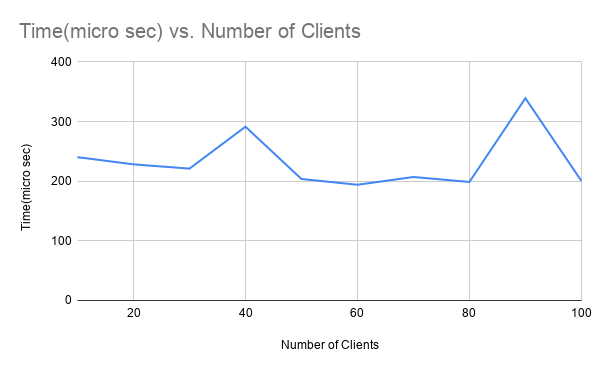
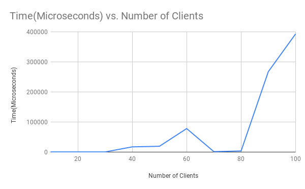
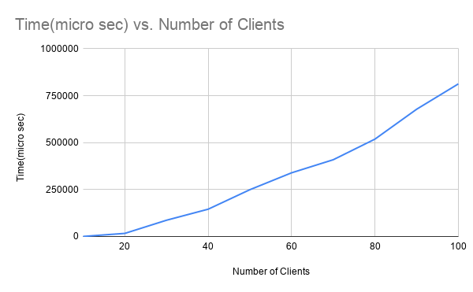

# Assignment 1
A Muli-client chat Application with test bed to analyse performance

## Setup:
```
>make all
```

## Chat instruction
```
bin\server port
bin\client ip port name group_number

```

## Example
```
bin\server 6666
bin\client 17.0.0.1 6666 Shivam 1
bin\client 17.0.0.1 6666 Satyam 1
```
## Test run
```
python3 ./test/stats.py
use -d or --dev flag to generate log files.
 ```

## Performance Table and Charts::

### Only One group

|Number of Clients| Time(micro sec)|
|---|---|
|10| 240.385714|
|20| 228.330000|
|30| 221.181818|
|40| 291.465333|
|50| 203.793636|
|60| 194.106000|
|70| 207.119474|
|80| 198.786875|
|90| 339.205600|
|100|200.555263|

### 2 Groups
|Number of Clients| Time(micro sec)|
|---|---|
|10|	359.9275|
|20|	426.186471|
|30|	351.2376|
|40|	17303.55425|
|50|	19310.8812|
|60|	78157.80914|
|70|	1402.973929|
|80|	3679.855846|
|90|	267461.8337|
|100|	392802.5758|

### 3 Groups
|Number of Clients| Time(micro sec)|
|---|---|
|10|	357.625|
|20|	417.547|
|30|	5276.978667|
|40|	61122.56725|
|50|	42781.95881|
|60|	125801.3398|
|70|	245774.3228|
|80|	284741.6994|
|90|	448618.5388|
|100|	521071.2014|

### 5 groups

|Number of Clients| Time(micro sec)|
|---|---|
|10| 468.133000|
|20| 16686.249500|
|30| 86831.570667|
|40| 145670.022750|
|50| 249502.891000|
|60| 339350.989333|
|70| 409052.546377|
|80| 518816.587875|
|90| 678022.167778|
|100| 812927.676200|

